# Fire Emissions deterministic model flow chart

## Purpose

This flow chart summarises the planned deterministic fire-impact/emissions model.

The model takes resolved rows from `fire_events`, inventory snapshot/lookup tables in `fire_db`, and deterministic emission parameters from `fire_emission_parameter_mapping`.

The model has two main stages:

1. Stage 1: affected stock / embodied replacement pathway.
2. Stage 2: direct gas-species emissions pathway.

The first-pass model does not implement stochastic or sensitivity analysis, although it preserves lower/default/upper ranges where already available.

---

## High-level process

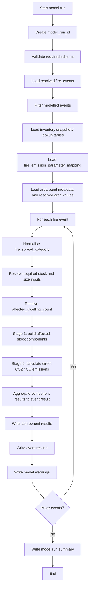

---

## Stage 1 and Stage 2 separation

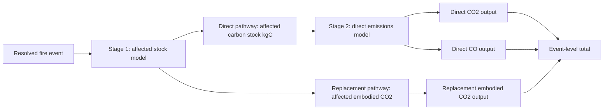

Key distinction:

```text
Direct pathway:
    inventory carbon stock kgC
    -> combusted kgC
    -> direct CO2 / CO produced

Replacement pathway:
    inventory room/dwelling embodied CO2
    -> replacement-affected embodied CO2
```

Replacement embodied CO2 is not converted from combusted kgC. It uses the room-level embodied CO2 values now appended to `inventory_room_snapshot`.

---

## Event category routing

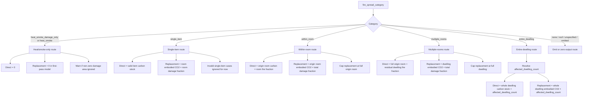

---

## Stage 1: affected stock / replacement components

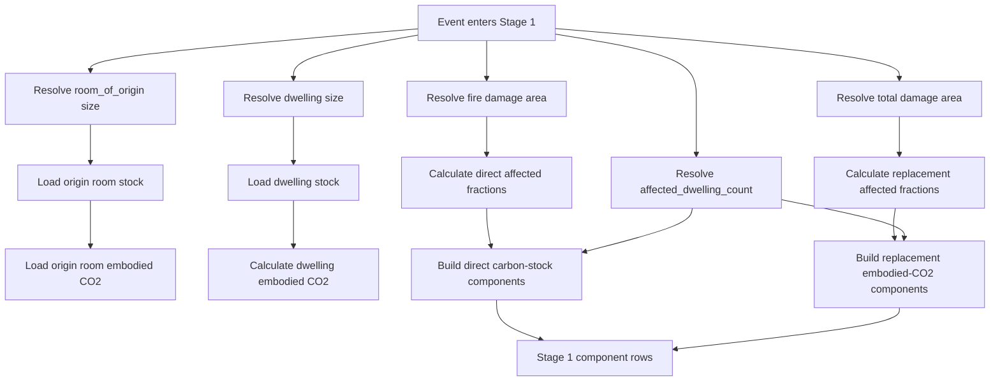

Stage 1 should preserve ranges where available:

```text
direct_total_kgC_lower / default / upper
direct_biogenic_kgC_lower / default / upper
direct_fossil_kgC_lower / default / upper

replacement_embodied_CO2_kg_lower / default / upper
```

Exact suffixes should match the existing inventory snapshot column naming once the code is inspected.

---

## Area handling

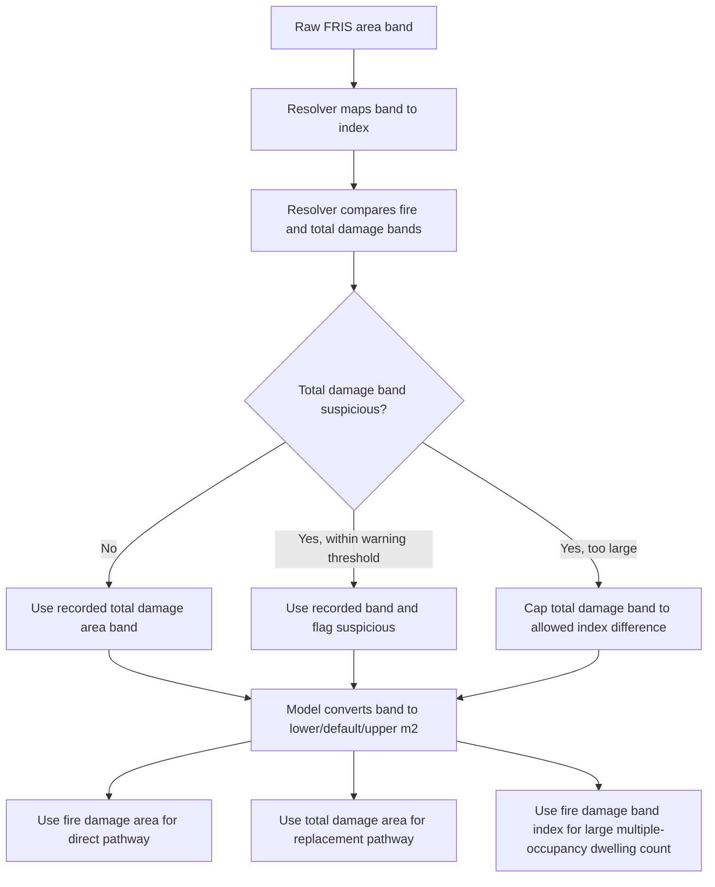

Planned area-band value rule:

```text
For closed area bands:
    lower   = lower bound
    default = lower bound + 0.33 × band width
    upper   = upper bound

For "None":
    lower = default = upper = 0

For open-ended bands:
    apply controlled caps from dwelling size, room size, or explicit model assumptions.
```

The model should rely on existing resolver traffic-light handling for suspicious fire/total damage-area mismatches, rather than micromanaging every unlikely FRIS entry again.

---

## Multiple-occupancy affected dwelling count

This Stage 1 model assumption corrects a known undercount risk for large fires in multiple-occupancy dwellings. FRIS can record large fires involving multiple dwellings within a block as a single incident. Treating these as one affected dwelling would therefore underestimate both direct affected stock and replacement embodied CO2.

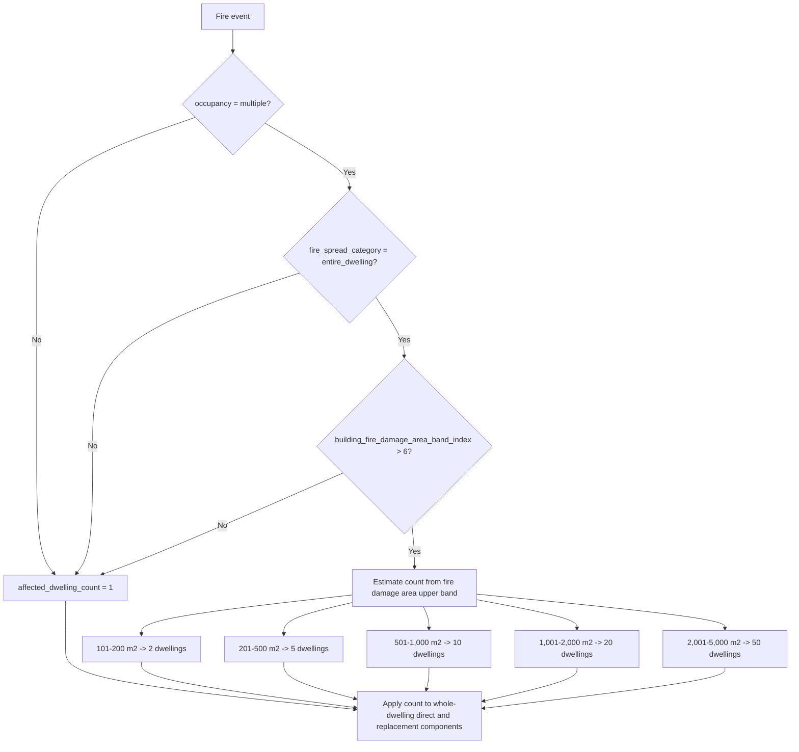

First-pass lookup:

```text
building_fire_damage_area_band_index = 6  -> 1 dwelling   # 51-100 m2
building_fire_damage_area_band_index = 7  -> 2 dwellings  # 101-200 m2
building_fire_damage_area_band_index = 8  -> 5 dwellings  # 201-500 m2
building_fire_damage_area_band_index = 9  -> 10 dwellings # 501-1,000 m2
building_fire_damage_area_band_index = 10 -> 20 dwellings # 1,001-2,000 m2
building_fire_damage_area_band_index = 11 -> 50 dwellings # 2,001-5,000 m2
```

Resolution:

```text
This rule is only applied when:
    occupancy = 'multiple'
    AND fire_spread_category = 'entire_dwelling'
    AND building_fire_damage_area_band_index > 6

The estimate uses one affected dwelling per 100 m2 of the upper fire-damage area band.
This is intentionally conservative and may underestimate affected dwellings in high-density blocks or tower blocks.

Future work could interpolate more realistic values within area bands and divide by dwelling-type-specific floor area, but that would require additional empirical case research.
```

The affected dwelling count should be carried into Stage 1 output rows where possible, ideally as:

```text
affected_dwelling_count
affected_dwelling_count_method
```

Suggested method values:

```text
single_dwelling_default
multiple_occupancy_fire_damage_area_upper_band_per_100m2
```

---

## Stage 2: direct emissions calculation

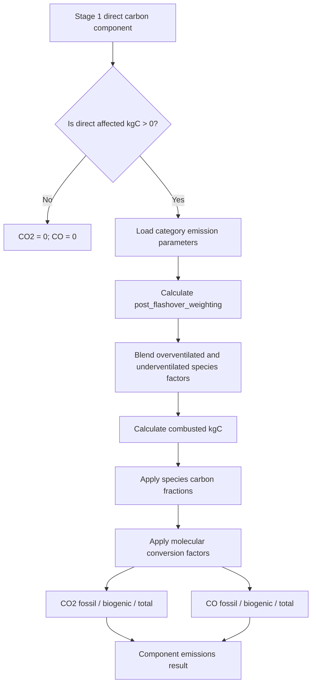

General formula:

```text
emitted_species_kg =
    direct_affected_kgC
    × combustion_completeness_factor
    × char_formation_factor
    × species_emission_factor
    × molecular_conversion_factor
```

Current molecular conversion factors:

```text
C_to_CO2_conversion_factor = 44 / 12
C_to_CO_conversion_factor  = 28 / 12
```

Current species:

```text
CO2
CO
```

The calculation should be generic enough to support additional species later, provided they are added to `fire_emission_parameter_mapping` and a molecular conversion factor exists.

---

## Fire-development / species-factor blending

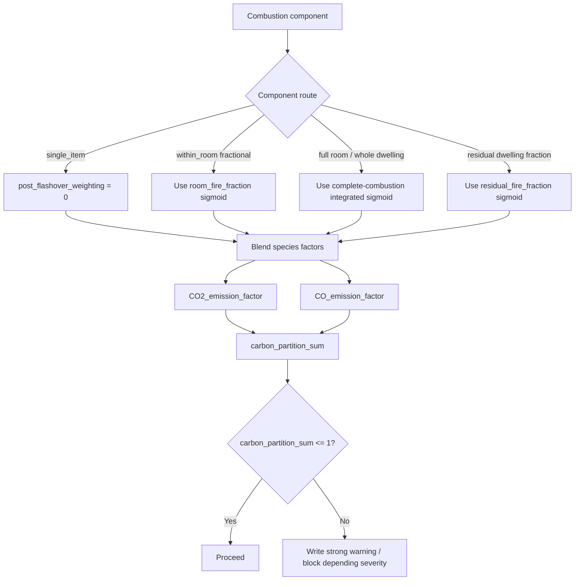

Species-factor blending:

```text
species_emission_factor =
    (1 - post_flashover_weighting) × species_emission_factor_overventilated
    + post_flashover_weighting × species_emission_factor_underventilated
```

Interpretation:

```text
post_flashover_weighting = 0
    fully overventilated / pre-flashover endpoint

post_flashover_weighting = 1
    fully underventilated / post-flashover endpoint
```

`room_fire_fraction` is a post-event fire-development proxy. It should not be described as a true equivalence ratio.

---

## Category-specific component logic

### heat_smoke_damage_only

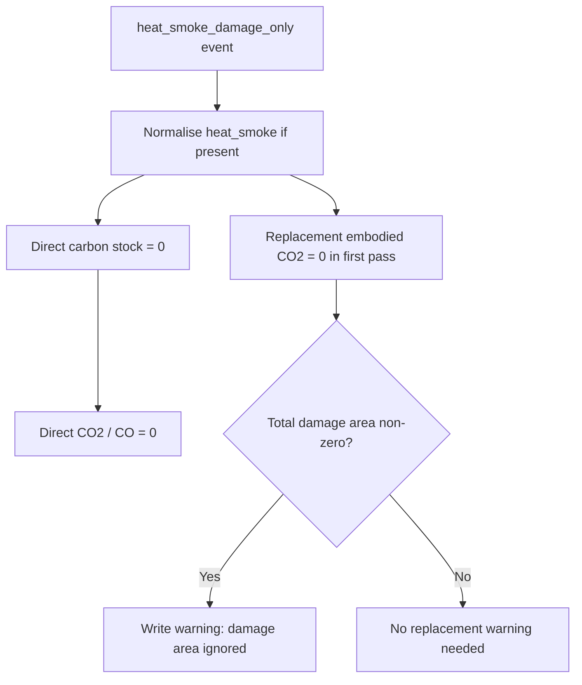

Resolution:

```text
Assume zero direct and zero replacement emissions for first-pass model.
This avoids overestimating replacement from suspicious heat/smoke-only FRIS damage-area entries.
```

---

### single_item

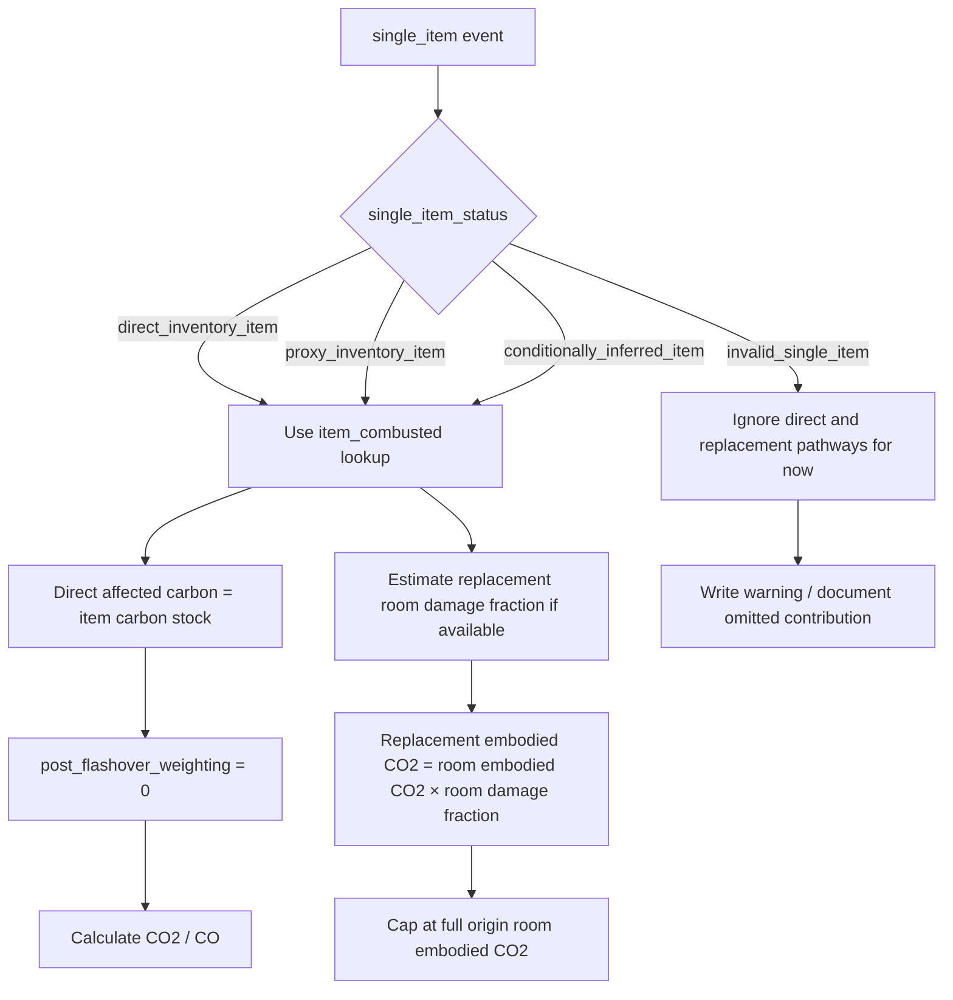

Resolution:

```text
Invalid single-item cases are deliberately ignored in the first-pass model due to time constraints.
They therefore do not contribute to direct or embodied/replacement emissions.
```

---

### within_room

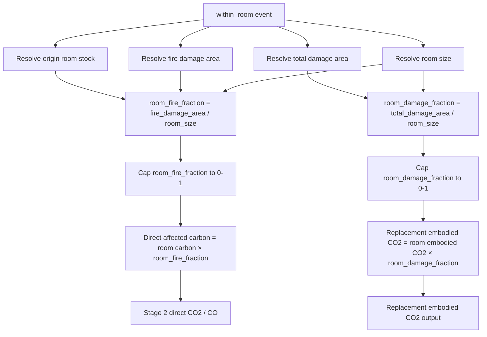

Resolution:

```text
Replacement is capped at full origin-room embodied CO2.
Do not allocate residual dwelling replacement for within-room events, even if total_damage_area appears larger than the room.
Suspicious total damage area should be warned, not micromanaged.
```

---

### multiple_rooms

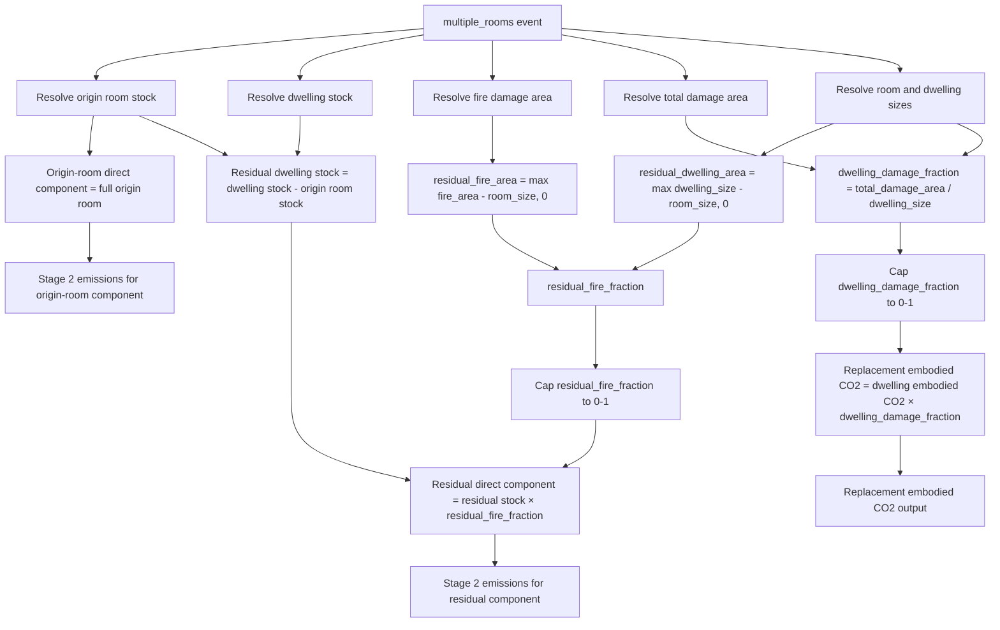

Resolution:

```text
Direct pathway is component-based:
    full origin room + residual dwelling fire fraction.

Replacement pathway uses total damage fraction over the dwelling and is capped at full dwelling embodied CO2.
```

---

### entire_dwelling

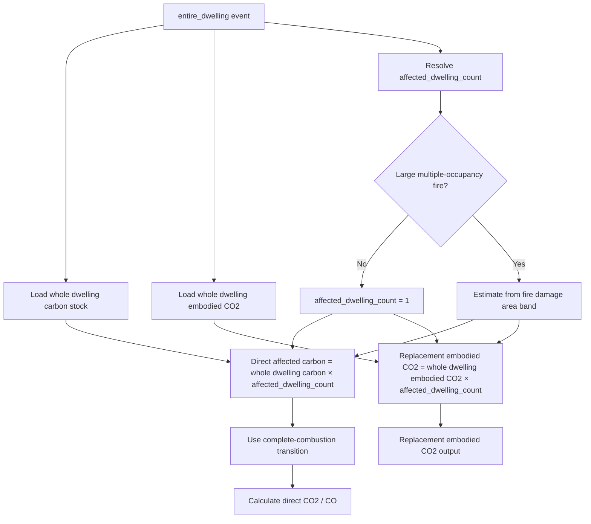

Resolution:

```text
For ordinary entire-dwelling events, affected_dwelling_count = 1.

For multiple-occupancy entire-dwelling events with building_fire_damage_area_band_index > 6, estimate affected_dwelling_count from the upper fire-damage area band using one dwelling per 100 m2.

Apply affected_dwelling_count to both:
    direct whole-dwelling carbon stock
    replacement whole-dwelling embodied CO2

Fire and total damage areas can still be retained as diagnostics.
```

---

## Results writing

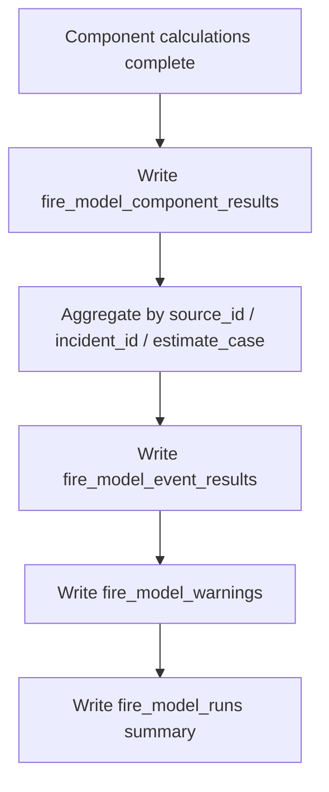

Suggested result tables:

```text
fire_model_runs
fire_model_component_results
fire_model_event_results
fire_model_warnings
```

Suggested run metadata:

```text
model_run_id
model_version
created_at_utc
parameter_source_id
inventory_snapshot_id
input_type
estimate_case
run_notes
```

Suggested component types:

```text
heat_smoke_damage_only
single_item
origin_room
within_room_fraction
residual_dwelling
whole_dwelling
```

Suggested estimate cases:

```text
lower
default
upper
```

The first implemented result can use only `default`, with `lower` and `upper` added once the central model is stable.

---

## Model warnings and limitations

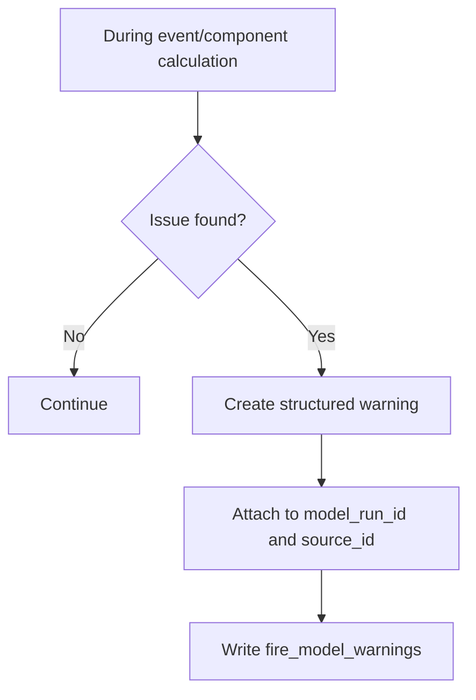

Warnings to support:

```text
HEAT_SMOKE_DAMAGE_AREA_IGNORED
HEAT_SMOKE_REPLACEMENT_ASSUMED_ZERO
INVALID_SINGLE_ITEM_IGNORED
ROOM_SIZE_MEAN_USED
DWELLING_SIZE_MEAN_USED
FIRE_AREA_CAPPED_TO_ROOM_SIZE
FIRE_AREA_CAPPED_TO_DWELLING_SIZE
TOTAL_DAMAGE_AREA_CAPPED_TO_ROOM_SIZE
TOTAL_DAMAGE_AREA_CAPPED_TO_DWELLING_SIZE
MULTIPLE_OCCUPANCY_AFFECTED_DWELLING_COUNT_ESTIMATED
MULTIPLE_OCCUPANCY_AFFECTED_DWELLING_COUNT_OPEN_ENDED
RESIDUAL_DWELLING_AREA_ZERO
RESIDUAL_STOCK_FALLBACK_USED
CARBON_PARTITION_EXCEEDS_ONE
CHAR_FORMATION_PARAMETER_NEUTRAL
OMITTED_EVENT_NO_MODEL_CONTRIBUTION
```

Important documented limitations:

```text
1. heat_smoke_damage_only events are assigned zero replacement emissions in the first-pass model.
2. invalid_single_item cases are ignored and therefore do not contribute to direct or embodied emissions.
3. omitted fire_events rows cannot contribute to the model outputs.
4. suspicious FRIS area-band inputs are handled primarily by resolver warnings and capped model values, not manual case-by-case corrections.
5. direct fire-produced CO2 / CO is kept separate from replacement embodied CO2.
6. replacement embodied CO2 is based on room/dwelling embodied CO2 values in inventory_room_snapshot.
7. large multiple-occupancy entire-dwelling fires estimate affected_dwelling_count from broad FRIS fire-damage area bands using one dwelling per 100 m2 of the upper band. This is a conservative first-pass assumption and may underestimate high-density block or tower-block fires.
```
